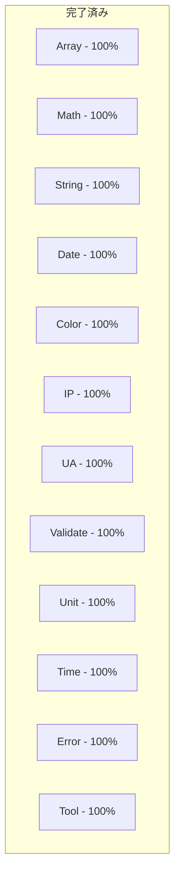
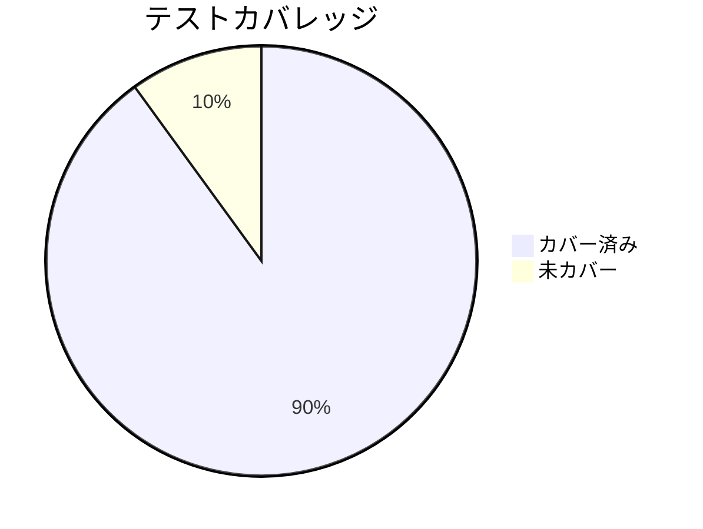

# UMT Progress Report

## 完了している機能

### コアモジュール実装状況

### Array機能

- ソートアルゴリズム（QuickSort, MergeSort, TimSort等）
- 配列操作（chunk, compact, drop等）
- 検索機能（binarySearch等）
- ユーティリティ関数（shuffle, range等）

### Math機能

- 基本演算（加減乗除）
- 高度な計算（階乗、組み合わせ、順列等）
- 変換機能（進数変換、角度変換等）
- 確率・統計（標準偏差、中央値等）

### 型システム

- 厳格な型定義
- ジェネリック型の活用
- 型安全性の確保
- 共通型の定義

### テスト

- ユニットテストの実装
- エッジケースのカバー
- テストヘルパーの整備

## 実装予定の機能

### Short Term（1-2ヶ月）

1. SimpleAPI拡充
   - 基本機能のラッパー
   - 簡易インターフェース
   - ドキュメント整備

2. パフォーマンス最適化
   - バンドルサイズ削減
   - 実行速度改善
   - メモリ使用量最適化

### Mid Term（3-6ヶ月）

1. Advanced機能追加
   - 高度なアルゴリズム
   - 追加のユーティリティ
   - カスタマイズオプション

2. ドキュメント強化
   - APIリファレンス
   - チュートリアル
   - サンプルコード

### Long Term（6ヶ月以上）

1. エコシステム拡大
   - プラグインシステム
   - サードパーティ統合
   - コミュニティツール

## 現在のステータス

### 開発状態

- コア機能: 安定版
- Simple API: 開発中
- Advanced機能: 計画段階
- ドキュメント: 更新中

### テストカバレッジ

### 品質指標

- ESLintエラー: 0
- Biome警告: 0
- TypeScriptエラー: 0
- テスト成功率: 100%

## 既知の問題

### 要対応事項

1. 一部のエッジケースでのパフォーマンス最適化
2. 大規模データセットでのメモリ使用量
3. 特定の環境での型定義の改善
4. ドキュメントの一部不足

### 制限事項

- ブラウザ互換性の制限
- 特定の機能での計算精度の限界
- メモリ使用量の制約
- 非同期処理の制限

### 検討中の改善点

1. バンドルサイズのさらなる最適化
2. Tree-shakingの改善
3. 型定義の拡充
4. エラーメッセージの改善
