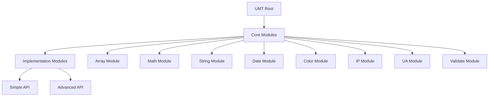
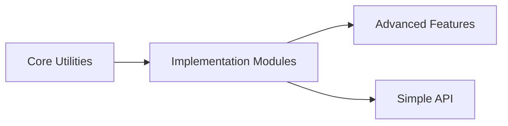

# UMT System Patterns

## アーキテクチャ設計

### モジュール構造

### ファイル構造パターン

- モジュールごとに独立したディレクトリ
- index.tsによるエントリーポイントの提供
- テストファイルは別ディレクトリに配置
- 型定義は専用ディレクトリで管理

## 技術的決定

### 型システム

- TypeScriptの厳格なモード使用
- 明示的な型定義の強制
- ジェネリック型の活用
- 共通型の再利用

### エラー処理

- 型安全なエラーハンドリング
- カスタムエラー型の定義
- エラーメッセージの標準化
- エラー発生時のグレースフルな処理

### テスト戦略

- ユニットテストの完全性
- エッジケースのカバレッジ
- テストケースの明確な命名
- テストデータの分離

## 設計パターン

### モジュールパターン

- 関連する機能のグループ化
- 明確な依存関係の定義
- カプセル化による実装の隠蔽
- インターフェースの一貫性

### ユーティリティパターン

- 純粋関数の優先
- 副作用の最小化
- 入力の検証
- 出力の一貫性

### 拡張パターン

- プラグアブルな設計
- 柔軟なオプション設定
- 機能の組み合わせ可能性
- バックワードコンパチビリティ

## コンポーネント関係

### 依存関係管理

### モジュール間通信

- 明確なインターフェース定義
- 型による契約
- エラー伝播の制御
- 一貫した戻り値の形式

### 拡張ポイント

- プラグイン機構
- カスタマイズ可能なオプション
- フックポイントの提供
- イベント処理の統一
